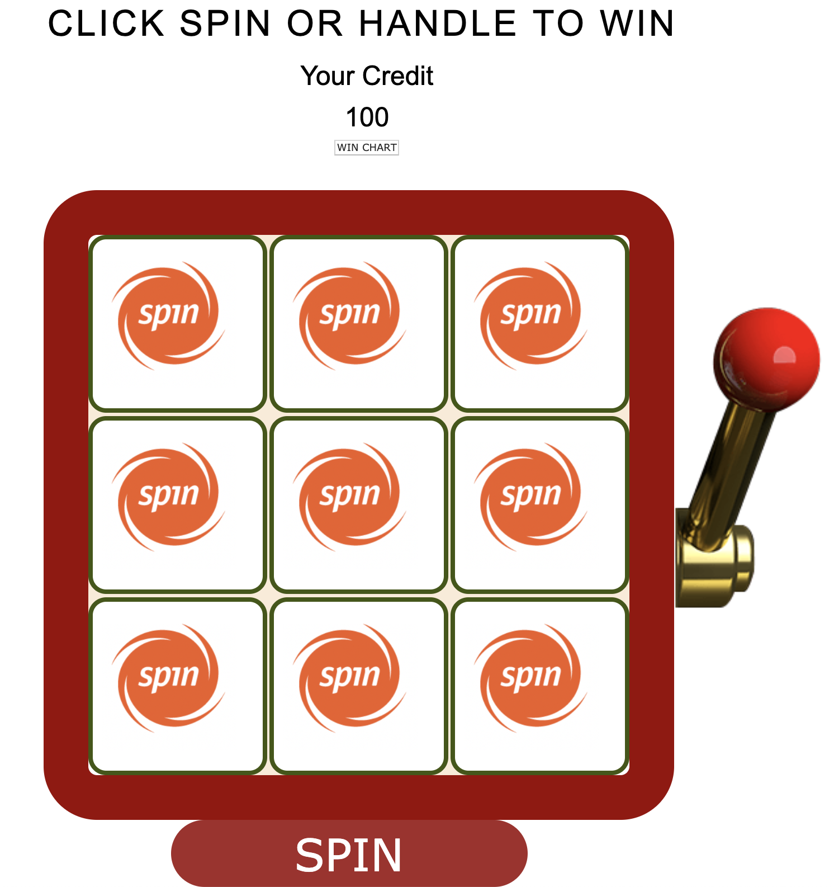

# 
Slot-Machine-Project 1

Start Game by clicking here: https://gebtraze11.github.io/Slot-Machine/
---

---
## GamePlay
---
Slot Machine is a display with three reels which changes the reel icons when a lever is pulled or button pushed. It is usually used in gamblimg purpose. After spin, if the reel matches unique combination the machine returns certain credit to user and viceversa.

---

## Game Screen

## Made by using
* HTML
* Css
* Javascript & Jquery

# Pseudocode
### Game Display 

* Player will be asked how much they want to bet
* Screen will have main Slot machine in between the page
    * The machine will have 3 rows and 3 column, and each cloumn will have numbers from 0 - 9.
    * Slot machine will only display 3 x 3 box.
    * On "Spin" all icons in all column will change randomily.
  
    

### Winning

* Only middle row will be checked for winner
* If 2 numbers in the middle row matches || ON Alert: the initial bet amount will be returned.
* If all 3 numbers in middle row matches, || On Alert: You won (bet amount x 5 ) .
* IF nothing matches, No Win.
    * If no Win start again by asking the betting amount.

#### Click Exit to exit to main menu (First Start Button)
#### Click Stop Now Button to stop machine animation and evaluate result.

---
---

## 
Additional Plan

* Add blinking/flashing lights on the Main Machine 
* Add stop now button to stop 7 sec rolling time and display result right after.
* Be able to drag the handle and make the machine spin.
* Give player certain credit and start game from there
    * If player looses all, prompt to restart game with credits.
* Add sound || start || Spin or drag || Win or lose.
* Include all 3 x 3 boxes and evaluate all possible winners.

----
----
## 
Basic Challanges

* Animate numbers accordingly
* Drag Handle.
* If added :
    * (Row - Column - Diagonal) winner check
    * Evaluate and calculate first given betting amount and change it accordingly to game.
    * Adding sound :
        * Sound timing : before game starts, when numbers are spinning and when it ends to decide win or nothing.
---
---

# 
WIREFRAME

## How numbers in each column will be placed.

----
## Game Screen.

